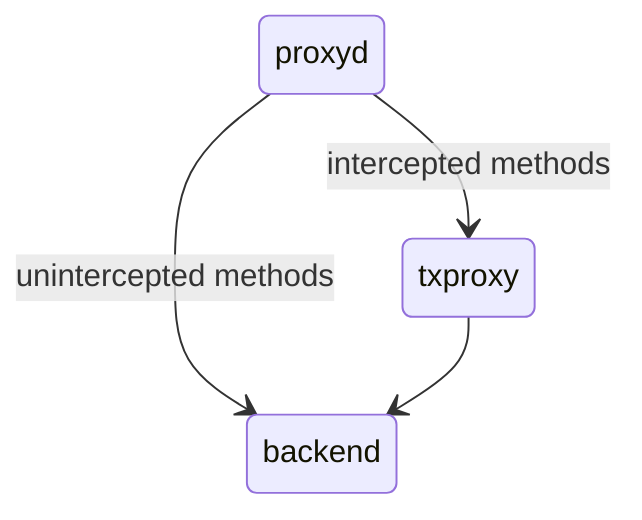

# op-txproxy

A supplemental passthrough proxy for some execution engine endpoints. This proxy does not forward all rpc traffic and only exposes a specific set of endpoints.
Operationally, the public ingress proxy should  only re-route requests for these endpoints.



## Setup
Install go 1.21
```
make build
./bin/op-txproxy --help
```

## Endpoints

### eth_sendRawTransactionConditional

An outcome of how to integrate this [spec](https://notes.ethereum.org/@yoav/SkaX2lS9j) safely for permissionless 4337 bundler participation. This solution in the design doc [proposal](https://github.com/ethereum-optimism/design-docs/blob/main/ecosystem/sendRawTransactionConditional/proposal.md)
requires a validating proxy that can be horizontally scaled and pre-emptively reject invalid conditional transaction. The implemented endpoint covers
these objectives:
1. **Auth**. preemptively put in place to enable a variety of auth policies (allowlist, rate limits, etc).

    The caller authenticates themselves with any valid ECDSA-secp256k1 key, like an Ethereum key. The computed signature is over the [EIP-191](https://eips.ethereum.org/EIPS/eip-191) hash of the request body (up to the 5MB request body limit).

    With the signature and signing address, the request is authenticated via the `X-Optimism-Signature` header of the request with the value `<public key address>: <signature>`.

2. **Rate Limits**. global rate limits on the endpoint are applied here.
2. **Rejection Switch**. this proxy can be rolled with a flag/env switch to reject conditional transaction without needing to interrupt the execution engine.
3. **Basic Validation**. stateless validation is done in the endpoint to reject invalid conditional transactions and apply additional restricts on the usage (only 4337 entrypoint tx target support).
4. **Metrics**. performance of this endpoint can be observed in order to inform adjustments to rate limits, shutoff, or auth policies to implement.
